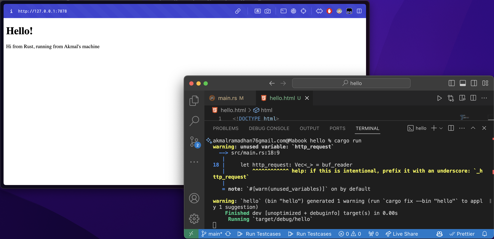
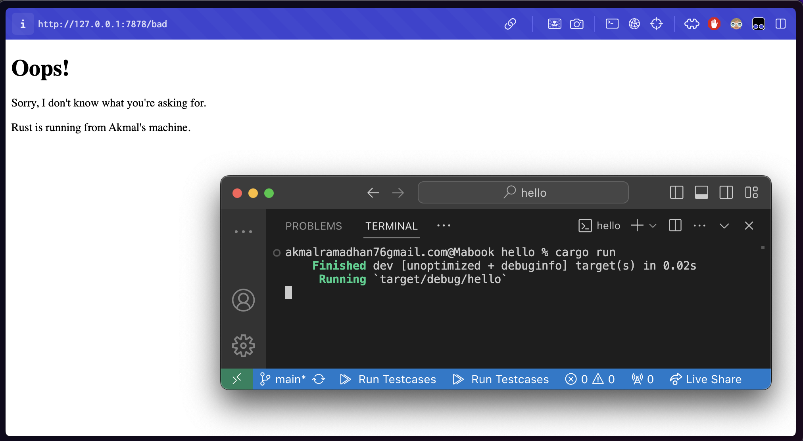

# Advance Programming - Tutorial 6

- Nama: Akmal Ramadhan
- NPM: 2206081534
- Kelas: Pemrograman Lanjut A

## Milestone 1: Single-Threaded Web Server

Dalam membuat _single-threaded web server_, terdapat dua protokol utama yang terlibat yaitu **Hypertext Transfer Protocol (HTTP)** dan **Transmission Control Protocol (TCP)**. Prinsip dari kedua protokol ini yaitu _request-respone_ artinya _server_ menerima dan merespon _request_ dari _client_.

**TCP** adalah protokol tingkat rendah yang menjelaskan bagaimana informasi berpindah dari satu _server_ ke _server_ lainnya namun tidak menentuk apa informasi tersebut sedangkan **HTTP** berguna untuk menentukan konten _request_ dan _response_. Data dari HTTP ini dikirim melalui TCP.

Pada awalnya, program ini hanya mampu menerima koneksi _browser request_ dengan menggunakan `TcpListener` ke alamat `127.0.0.1:7878`. Program akan mencetak `Connection established!` setiap kali koneksi tersebut diterima.

* `bind()`: Menghubungkan `TcpListener` dengan alamat dan _port_ tertentu pada mesin lokal untuk didengarkan koneksinya.

* `unwrap()`: Mengekstrak nilai dari sebuah `Result` atau `Option`. Jika hasilnya adalah `Ok` atau `Some`, maka nilai yang terkandung di dalamnya akan dikembalikan. Namun, jika hasilnya adalah `Err` atau `None`, maka `unwrap` akan menyebabkan program mengalami _panic_ dan berhenti, menunjukkan bahwa terjadi masalah yang serius.

* `incoming()`: Menerima koneksi yang masuk pada `TcpListener`. Ini mengembalikan sebuah iterator yang menghasilkan `Result<TcpStream, Error>`, di mana setiap elemen iterator tersebut adalah _stream_ yang mewakili koneksi terbuka antara _client_ dan server. Kita dapat menerima koneksi secara berurutan dan menanganinya satu per satu.

Untuk menangani bagaimana _server_ akan berperilaku ketika menerima _request_ dari _browser_, dibuat _method_ `handle_connection()`. Konsol akan memberikan pesan HTTP (`http request`) di akhir _method_.

* `BufReader` membaca _stream_ atau baris-baris dari `TcpStream` dengan metode `lines()`.
* `http_request` mengumpulkan baris-baris permintaan HTTP yang diterima dari browser.

## Milestone 2: Returning HTML
Screenshot:


Fungsi `handle_connection` menggunakan `fs::read_to_string` untuk membaca konten dari file `hello.html` ke dalam sebuah string. Hal tersebut berguna untuk mengirimkan konten HTML sebagai bagian dari respons yang dikirimkan kembali kepada pengguna.

Setelah itu, buat respons HTTP dengan status line `"HTTP/1.1 200 OK"` dan _header_ `Content-Length` yang menunjukkan panjang dari konten HTML yang akan dikirimkan, dan menambahkan konten HTML sebagai badan (body) dari respons.

Selanjutnya, kita mengirimkan respons tersebut melalui _stream_ TCP menggunakan metode `write_all`.

## Milestone 3: Validating Request and Selectively Responding
Screenshot:


Pada awalnya, _web server_ selalu menampilkan `hello.html` apapun _request_-nya. Kali ini, kita menambahkan fungsionalitas untuk memeriksa apakah browser meminta `/` sebelum mengembalikan file HTML. Jika permintaan tidak sesuai, kita akan mengembalikan respons dengan kode status `404` dan halaman error HTML yang sesuai. Penerapan `404.html` mirip seperti `hello.html`.

```rust
let request_line = buf_reader.lines().next().unwrap().unwrap();
```
* `.lines()`, mendapatkan iterator baris-baris dari `BufReader`.
* `.next()`, mendapatkan opsi pertama dari iterator tersebut.
* `unwrap()` pertama, mengeluarkan opsi yang mungkin (`Option`) dari `. next()`
* `unwrap()` kedua, mengeluarkan nilai yang mungkin (`Result`) dari hasil `.next()` tersebut.

Saya melakukan _refactoring_ pada `main.rs` agar tetap sesuai dengan _clean code_. yaitu `DRY` (Don't Repeat Yourself). Langkah yang saya lakukan yaitu keluarkan semua variabel yang sama pada blok `if-else`. Perhatikan bahwa sebelumnya `contents` dan `status_line` didefinisikan spesifik untuk tiap blok `if` dan `else`. Hal ini menyebabkan variabel ini tidak dapat digunakan di luar cakupan tersebut. Untuk itu, gunakan `let (status_line, contents) = ...` untuk menangani hal tersebut.

## Referensi
[Final Project: Building a Multithreaded Web Server](https://rust-book.cs.brown.edu/ch20-00-final-project-a-web-server.html)